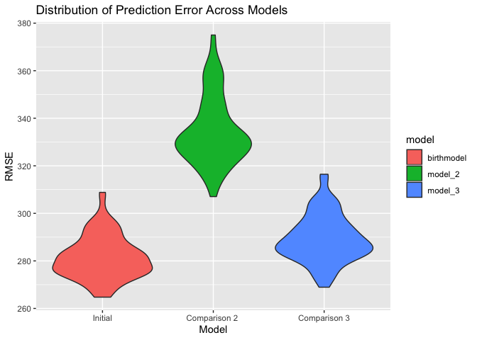

Homework 6
================
Connie Zhang

## Question 1

``` r
birth_data = read_csv("./data/birthweight.csv") %>% 
janitor::clean_names() %>%
mutate (
  babysex = recode(babysex, "1" = "male", "2" = "female"),
  frace = recode(frace,
                        "1" = "white",
                        "2" = "black",
                        "3" = "asian",
                        "4" = "puetro rican",
                        "8" = "other",
                        "9" = "unknown"),
         mrace = recode(mrace,
                        "1" = "white",
                        "2" = "black",
                        "3" = "asian",
                        "4" = "puetro rican",
                        "8" = "other"),
           malform = recode(malform, 
                          "0" = "absent",
                          "1" = "present"
                          ))  
```

    ## Parsed with column specification:
    ## cols(
    ##   .default = col_double()
    ## )

    ## See spec(...) for full column specifications.

``` r
birth_data
```

    ## # A tibble: 4,342 x 20
    ##    babysex bhead blength   bwt delwt fincome frace gaweeks malform menarche
    ##    <chr>   <dbl>   <dbl> <dbl> <dbl>   <dbl> <chr>   <dbl> <chr>      <dbl>
    ##  1 female     34      51  3629   177      35 white    39.9 absent        13
    ##  2 male       34      48  3062   156      65 black    25.9 absent        14
    ##  3 female     36      50  3345   148      85 white    39.9 absent        12
    ##  4 male       34      52  3062   157      55 white    40   absent        14
    ##  5 female     34      52  3374   156       5 white    41.6 absent        13
    ##  6 male       33      52  3374   129      55 white    40.7 absent        12
    ##  7 female     33      46  2523   126      96 black    40.3 absent        14
    ##  8 female     33      49  2778   140       5 white    37.4 absent        12
    ##  9 male       36      52  3515   146      85 white    40.3 absent        11
    ## 10 male       33      50  3459   169      75 black    40.7 absent        12
    ## # … with 4,332 more rows, and 10 more variables: mheight <dbl>,
    ## #   momage <dbl>, mrace <chr>, parity <dbl>, pnumlbw <dbl>, pnumsga <dbl>,
    ## #   ppbmi <dbl>, ppwt <dbl>, smoken <dbl>, wtgain <dbl>

``` r
#checking for missing values 
sum(!complete.cases(birth_data))
```

    ## [1] 0

  - There are no missing values in the data, as shown by the `0` value
    output.

<!-- end list -->

``` r
birthmodel_fit = lm(bwt ~ 
                      gaweeks + 
                      delwt + 
                      fincome +
                      bhead +
                      blength +
                      smoken, 
                    data = birth_data) 

summary(birthmodel_fit) 
```

    ## 
    ## Call:
    ## lm(formula = bwt ~ gaweeks + delwt + fincome + bhead + blength + 
    ##     smoken, data = birth_data)
    ## 
    ## Residuals:
    ##     Min      1Q  Median      3Q     Max 
    ## -1180.2  -184.1    -8.4   178.2  2514.7 
    ## 
    ## Coefficients:
    ##               Estimate Std. Error t value Pr(>|t|)    
    ## (Intercept) -6185.0498    94.9858 -65.115  < 2e-16 ***
    ## gaweeks        13.8723     1.4860   9.335  < 2e-16 ***
    ## delwt           2.0874     0.1983  10.526  < 2e-16 ***
    ## fincome         1.2509     0.1659   7.538 5.79e-14 ***
    ## bhead         133.4445     3.4853  38.287  < 2e-16 ***
    ## blength        78.6686     2.0610  38.170  < 2e-16 ***
    ## smoken         -2.6158     0.5806  -4.505 6.80e-06 ***
    ## ---
    ## Signif. codes:  0 '***' 0.001 '**' 0.01 '*' 0.05 '.' 0.1 ' ' 1
    ## 
    ## Residual standard error: 280.5 on 4335 degrees of freedom
    ## Multiple R-squared:  0.7004, Adjusted R-squared:    0.7 
    ## F-statistic:  1689 on 6 and 4335 DF,  p-value: < 2.2e-16

  - These variables were chosen as well-known and regarded predictors of
    birthweight for newborns, including both biological, health, and
    socioeconomic factors.

<!-- end list -->

``` r
birth_data %>%
  
  modelr::add_residuals(birthmodel_fit) %>%
  modelr::add_predictions(birthmodel_fit) %>%
  ggplot(aes(x = pred, y = resid)) +
  geom_point() + geom_hline(yintercept = 0, linetype = "dashed", color = "blue") 
```

<!-- -->

``` r
  labs(
        title = "Residuals vs. Predicted Values on a Hypothesized Model")
```

    ## $title
    ## [1] "Residuals vs. Predicted Values on a Hypothesized Model"
    ## 
    ## attr(,"class")
    ## [1] "labels"

  - The majority of residuals fall around the value of 0 and show
    constant variance. A few are shown as extremely high or low
    residuals, which could be outliers or data entry errors.

<!-- end list -->

``` r
model_2 = lm(bwt ~ blength + gaweeks, data = birth_data) 

model_3 = lm(bwt ~ bhead + babysex + blength + bhead * babysex * blength, data = birth_data) 
```

``` r
comp_data = 
  crossv_mc(birth_data, 100) %>%

  mutate(train = map(train, as_tibble),
         test = map(test, as_tibble)) 

comp_data = 
  comp_data %>% 
  mutate(newbirthmodel_fit  = map(train, ~lm(bwt ~ 
                      gaweeks + 
                      delwt + 
                      fincome + 
                      bhead + 
                      blength +
                      smoken, data = .x)),
         new_model_2    = map(train, ~lm(bwt ~ blength + gaweeks, data = .x)),
         new_model_3  = map(train, ~gam(bwt ~ bhead + babysex + blength + bhead * babysex * blength, data = as_tibble(.x)))) %>% 
  
  mutate(rmse_birthmodel = map2_dbl(newbirthmodel_fit, test, ~rmse(model = .x, data = .y)),
         rmse_model_2    = map2_dbl(new_model_2, test, ~rmse(model = .x, data = .y)),
         rmse_model_3 = map2_dbl(new_model_3, test, ~rmse(model = .x, data = .y))) 
```

``` r
comp_data %>%
select(starts_with("rmse")) %>% 
  pivot_longer(
      everything(),
      names_to = "model", 
      values_to = "rmse",
      names_prefix = "rmse_") %>% 
    mutate(model = fct_inorder(model)) %>% 
    ggplot(aes(x = model, y = rmse, fill = model)) +
  geom_violin() + 
   scale_x_discrete(labels=c("birthmodel" = "Initial", 
                            "model_2" = "Comparison 2 ",
                            "model_3" = "Comparison 3")) +
  labs(
    title = "Distribution of Prediction Error Across Models",
    x = "Model",
    y = "RMSE"
  )
```

<!-- -->

  - Through comparison across models, the initial model created
    (including gestational age, delivery weight of mother, financial
    income of mother, baby’s length and head size, as well as number of
    cigarettes smoked) has the lowest RMSE. This indicates that it is
    the strongest model.
